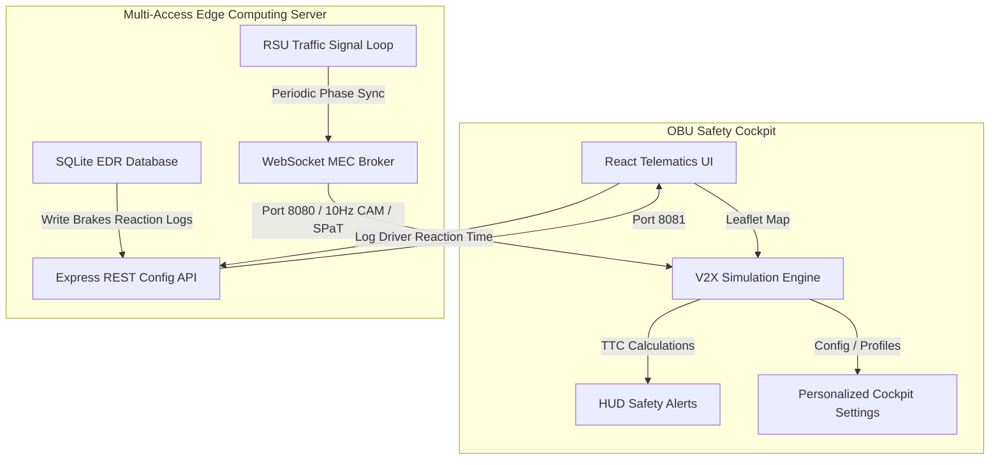

# Localized Edge V2X Communication & Safety Cockpit

A production-grade Connected Vehicle V2X (Vehicle-to-Everything) safety dashboard simulating high-frequency V2V, V2I, and V2P interactions on an interactive OpenStreetMap layer. The system simulates a vehicle OBU (On-Board Unit) interacting with preceding vehicles, roadside units (RSUs), and pedestrians, coordinated by a Multi-Access Edge Computing (MEC) broker.

---

## 🏗️ System Architecture

The application is structured as a full-stack edge simulation:



### 1. Edge MEC Server (`backend/`)
*   **WebSocket Broker (Port 8080):** Broadcasts high-frequency J2735 messages (CAM - Cooperative Awareness Messages, SPaT - Signal Phase and Timing, DENM - Decentralized Environmental Notification Messages) at 10Hz.
*   **REST Server (Port 8081):** Configures sidelink network delays, packet loss rates, and exposes endpoints to fetch/persist reaction events.
*   **SQLite EDR Logger:** Connects to `v2x_blackbox.db` to log safety incidents and drivers' brakes response times.

### 2. OBU Safety Cockpit (`frontend/`)
*   **Vite React Application:** Multi-pane dashboard styling utilizing modern dark glassmorphism and custom HSL colors.
*   **OpenStreetMap (Leaflet):** Renders real tiles centered on Market Street, San Francisco.
*   **Real-World Symbols:** Emojis enclosed in circular glowing indicator casings, dynamically rotated along the road vector heading.
*   **60FPS Physics Engine:** High-frequency loop optimized with React mutable refs to avoid hook closure traps, simulating smooth movement.

### 3. Shared Specification (`shared/`)
*   **J2735 ASN.1 Type Schemas:** Shared TypeScript definitions establishing strict interfaces for telematics telemetry and safety packets.

---

## 🚀 Key Features

*   **V2V Safety (Vehicle-to-Vehicle):** Click `Trigger V2V Brake` to simulate emergency braking in a preceding vehicle. The HUD displays a `COLLISION HAZARD` warning and logs reaction time when brakes are applied.
*   **V2I Safety (Vehicle-to-Infrastructure):** RSUs broadcast SPaT (Signal Phase & Timing) data. The cockpit renders a green/yellow/red traffic light indicator at the intersection, calculating GLOSA (Green Light Optimal Speed Advisory) target speeds.
*   **V2P Safety (Vehicle-to-Pedestrian):** Click `Spawn Pedestrian` to walk a pedestrian across the Market Street crosswalk, triggering immediate braking overlays.
*   **Black Box Event Data Recorder (EDR):** Automatically records incident logs (alert type, speed, driver style, network delay, reaction time in milliseconds) to the SQLite database.
*   **5G Network Degradation Simulator:** Slide selectors to inject sidelink latency (up to 400ms) and packet drop ratios (up to 50%) to observe how edge delays impact ADAS safety margins.

---

## 🛠️ Detailed Installation & Setup

Follow these comprehensive steps to configure and run the V2X simulator on your local machine:

### 1. Prerequisites
Ensure you have the following software installed:
*   **Node.js:** Version `18.0.0` or higher. Check your version with:
    ```bash
    node -v
    ```
*   **npm:** Version `9.0.0` or higher. Check your version with:
    ```bash
    npm -v
    ```
*   **Git:** To manage the repository codebase.

---

### 2. Dependency Installation

The project uses a workspace structure with a root dependency orchestrator. Installing dependencies at the root will automatically trigger child builds:

1.  **Clone the repository:**
    ```bash
    git clone https://github.com/tharuntulasi06/TATA-v2x.git
    cd TATA-v2x
    ```
2.  **Install all packages:**
    ```bash
    npm install
    ```
    *Note: The root `npm install` runs a post-install bootstrap script that automatically configures node modules for both the `backend/` and `frontend/` directories, setting up TypeScript compilation paths.*

---

### 3. Running the Simulation

You can run the full stack concurrently or start each module in a separate terminal.

#### Option A: Quick Start (Concurrent Execution)
Run both backend MEC broker and Vite frontend together in a single command:
```bash
npm run dev
```
*This starts the WebSocket server, REST endpoints, and Vite dev server concurrently, piping all terminal outputs to a unified log stream.*

#### Option B: Manual execution (Separate Terminals)
If you prefer to inspect process logs separately:
1.  **Start the Edge MEC Backend:**
    ```bash
    cd backend
    npm install
    npm run dev
    ```
    *Starts the WebSocket server on port `8080` and Express API on port `8081`. Initializes the SQLite database file `v2x_blackbox.db` automatically.*
2.  **Start the Dashboard Frontend:**
    ```bash
    cd frontend
    npm install
    npm run dev
    ```
    *Launches the Vite Dev Server on port `3000`.*

---

### 4. Database Setup & Verification
The SQLite database client is fully self-healing:
*   On the first boot of the backend server, a file named `v2x_blackbox.db` is created in the root directory.
*   The tables (`incidents`) are initialized automatically with column schema mapping (event type, reaction time, vehicle speed, driver profile, and network configs).
*   No database administration tool is required; however, you can inspect it with any SQLite viewer (e.g., [DB Browser for SQLite](https://sqlitebrowser.org/)).

---

## 🧪 Detailed Verification & Test Scenarios

Once the dashboard is running at [http://localhost:3000](http://localhost:3000), follow these scenarios to verify the system logic:

### Scenario A: Real-Time V2V Alert & Manual Braking
1.  Verify the map status overlay says `5G C-V2X ACTIVE`.
2.  Turn **Autopilot OFF** in the map footer controls (manual mode will display).
3.  Click the red **"Trigger V2V Brake"** button. The blue vehicle `🚙` ahead will decelerate, and the preceding vehicle's OBU will broadcast a safety warning.
4.  The top **V2X Target Scanning** HUD panel will flash a red **"COLLISION HAZARD"** alert showing the distance and Time-To-Collision (TTC) countdown.
5.  Press the **Spacebar** or **Down Arrow** key to apply the brakes.
6.  Check the **SQLite EDR Incident History (Black Box)** card at the bottom right. A new log entry will immediately appear showing your exact reaction time in milliseconds (e.g., `850 ms`).

### Scenario B: 5G Network Sidelink Degradation
1.  Navigate to the **5G C-V2X Net Degradation** slider section in the cockpit settings.
2.  Drag the **MEC Sidelink Delay** slider to `250 ms`.
3.  Observe that the top HUD panel displays a yellow **"MEC LATENCY CRITICAL"** network warning.
4.  Trigger a V2V Brake event. The alerts will trigger with a delay, and the recorded brakes response logs in the Black Box will register higher total reaction latency times.

---

## 🔍 Troubleshooting Guide

*   **Dashboard Status displays "OFFLINE":**
    *   Ensure the backend is running (`lsof -i :8080` on macOS or `netstat -ano | findstr 8080` on Windows).
    *   If port `8080` is already in use by another process, kill it:
        ```bash
        kill -9 $(lsof -t -i:8080)
        ```
    *   Refresh the browser page to re-trigger WebSocket handshakes.
*   **Map is blank or Tiles not rendering:**
    *   Verify your computer has an active internet connection. OpenStreetMap tiles are fetched dynamically from the OSM servers.
*   **EDR Logs not showing up in the Black Box list:**
    *   Ensure the backend REST API on port `8081` is running.
    *   Ensure you apply the brakes *while the red HUD warning is active*. Braking when no warning is present will not log an EDR record.

## 📂 Code Layout

*   [shared/types.ts](file:///Users/tharunt/v2x/shared/types.ts) — Strict schema typings for CAM, SPaT, DENM, and Safety Warnings.
*   [backend/src/server.ts](file:///Users/tharunt/v2x/backend/src/server.ts) — Main MEC server (WebSockets + REST endpoints).
*   [backend/src/db.ts](file:///Users/tharunt/v2x/backend/src/db.ts) — SQLite table initialization and logging writers.
*   [frontend/src/App.tsx](file:///Users/tharunt/v2x/frontend/src/App.tsx) — Main dashboard grid wrapper containing the cockpit telemetry layout.
*   [frontend/src/components/MapSimulation.tsx](file:///Users/tharunt/v2x/frontend/src/components/MapSimulation.tsx) — Leaflet container mapping canvas coordinate offsets onto real SF Market Street paths.
*   [frontend/src/components/HUDAlerts.tsx](file:///Users/tharunt/v2x/frontend/src/components/HUDAlerts.tsx) — Visual windshield warning alerts panel with flex layouts.
*   [frontend/src/components/InfotainmentConsole.tsx](file:///Users/tharunt/v2x/frontend/src/components/InfotainmentConsole.tsx) — Control panels for driver profiles, network delay configurations, and GLOSA advisories.
