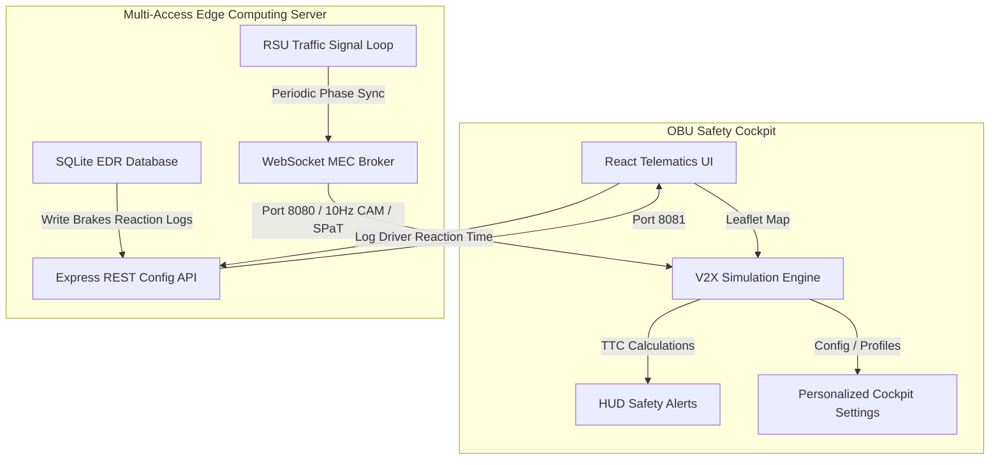

# Localized Edge V2X Communication & Safety Cockpit

A production-grade Connected Vehicle V2X (Vehicle-to-Everything) safety dashboard simulating high-frequency V2V, V2I, and V2P interactions on an interactive OpenStreetMap layer. The system simulates a vehicle OBU (On-Board Unit) interacting with preceding vehicles, roadside units (RSUs), and pedestrians, coordinated by a Multi-Access Edge Computing (MEC) broker.

---

## 🏗️ System Architecture

The application is structured as a full-stack edge simulation:



### 1. Edge MEC Server (`backend/`)
*   **WebSocket Broker (Port 8080):** Broadcasts high-frequency J2735 messages (CAM - Cooperative Awareness Messages, SPaT - Signal Phase and Timing, DENM - Decentralized Environmental Notification Messages) at 10Hz.
*   **REST Server (Port 8081):** Configures sidelink network delays, packet loss rates, and exposes endpoints to fetch/persist reaction events.
*   **SQLite EDR Logger:** Connects to `v2x_blackbox.db` to log safety incidents and drivers' brakes response times.

### 2. OBU Safety Cockpit (`frontend/`)
*   **Vite React Application:** Multi-pane dashboard styling utilizing modern dark glassmorphism and custom HSL colors.
*   **OpenStreetMap (Leaflet):** Renders real tiles centered on Market Street, San Francisco.
*   **Real-World Symbols:** Emojis enclosed in circular glowing indicator casings, dynamically rotated along the road vector heading.
*   **60FPS Physics Engine:** High-frequency loop optimized with React mutable refs to avoid hook closure traps, simulating smooth movement.

### 3. Shared Specification (`shared/`)
*   **J2735 ASN.1 Type Schemas:** Shared TypeScript definitions establishing strict interfaces for telematics telemetry and safety packets.

---

## 🚀 Key Features

*   **V2V Safety (Vehicle-to-Vehicle):** Click `Trigger V2V Brake` to simulate emergency braking in a preceding vehicle. The HUD displays a `COLLISION HAZARD` warning and logs reaction time when brakes are applied.
*   **V2I Safety (Vehicle-to-Infrastructure):** RSUs broadcast SPaT (Signal Phase & Timing) data. The cockpit renders a green/yellow/red traffic light indicator at the intersection, calculating GLOSA (Green Light Optimal Speed Advisory) target speeds.
*   **V2P Safety (Vehicle-to-Pedestrian):** Click `Spawn Pedestrian` to walk a pedestrian across the Market Street crosswalk, triggering immediate braking overlays.
*   **Black Box Event Data Recorder (EDR):** Automatically records incident logs (alert type, speed, driver style, network delay, reaction time in milliseconds) to the SQLite database.
*   **5G Network Degradation Simulator:** Slide selectors to inject sidelink latency (up to 400ms) and packet drop ratios (up to 50%) to observe how edge delays impact ADAS safety margins.

---

## 🛠️ Installation & Setup

### Prerequisites
*   Node.js (v18+)
*   npm

### Quick Start (Development)

1.  **Install dependencies in the root directory:**
    ```bash
    npm install
    ```
    *(This will automatically trigger postinstall scripts to configure package dependencies across `backend/` and `frontend/` folders).*

2.  **Launch the full stack concurrently:**
    ```bash
    npm run dev
    ```
    *   **Frontend Client:** Runs at [http://localhost:3000](http://localhost:3000)
    *   **WebSocket MEC Broker:** Runs on port `8080`
    *   **Express REST API Server:** Runs on port `8081`

3.  **To build for production:**
    ```bash
    npm run build
    ```

---

## 📂 Code Layout

*   [shared/types.ts](file:///Users/tharunt/v2x/shared/types.ts) — Strict schema typings for CAM, SPaT, DENM, and Safety Warnings.
*   [backend/src/server.ts](file:///Users/tharunt/v2x/backend/src/server.ts) — Main MEC server (WebSockets + REST endpoints).
*   [backend/src/db.ts](file:///Users/tharunt/v2x/backend/src/db.ts) — SQLite table initialization and logging writers.
*   [frontend/src/App.tsx](file:///Users/tharunt/v2x/frontend/src/App.tsx) — Main dashboard grid wrapper containing the cockpit telemetry layout.
*   [frontend/src/components/MapSimulation.tsx](file:///Users/tharunt/v2x/frontend/src/components/MapSimulation.tsx) — Leaflet container mapping canvas coordinate offsets onto real SF Market Street paths.
*   [frontend/src/components/HUDAlerts.tsx](file:///Users/tharunt/v2x/frontend/src/components/HUDAlerts.tsx) — Visual windshield warning alerts panel with flex layouts.
*   [frontend/src/components/InfotainmentConsole.tsx](file:///Users/tharunt/v2x/frontend/src/components/InfotainmentConsole.tsx) — Control panels for driver profiles, network delay configurations, and GLOSA advisories.
